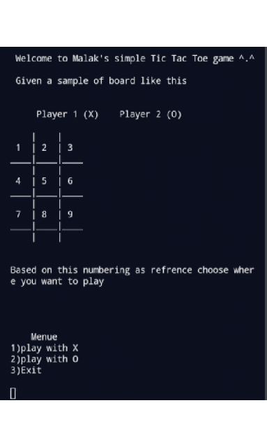

# tic_tac_toe


## Abstract

In this project we aim to implement a simple 2 players Tic Tac Toe game.
To do that i used 5 functions besides the main function;
one to print board with numbering as reference for user, the other to print 
board without numbering, third function to mark the board with X or O 
depending on which player did the user chose, fourth function to check the 
winner and finally the fifth to switch players .

## Introduction

The idea of the code I used is that we print a board of 9 boxes each box is an 
element of array, where this array contains of 10 elements, we also take inputs 
from the user which is the player if ‘X’, ’O’ or exit and the choices of the location of 
the box he wants to play in, then we pass these inputs by the 5 functions I talked 
about previously to implement the game successfully.
In the main function we used mainly a DO-While to loop over our code as long as 
there is no winner or the is no game draw (checker==-1), inside the main we also 
called our functions that we created and used different methods through the 
whole code but mainly if conditions played a great role in my code .
Now let’s move deeper through the code and it’s functions:

## Variables 

### Global 

* Char a[] : and this is an array of 10 elements each element is a space , we 
will use this array to trigger each box we want to enter a mark in it or 
examine out code conditions . 


### Other variables


* Int player: this integer is used to store which player is playing at this 
instance and check the winning and the mark through the game , the value
of the player changes depending on switching player 2 and player1 each 
turn


* Int player 1: this integer is equal to 1 and it is used as an input in the swap 
function to switch player each time and it is used as input for swap function


* Int player 2: this integer is equal to 2 and it is used as an input in the swap 
function to switch players each time and it’s used as input for swap 
function 


* Int markplayer: this is mainly used to examine the input of the player in the 
menu where is he chose player1 or player 2 or to exit if exit then 
markplayer is not equal 1 or 2 so break code and exit 


* Int marker: this integer is either 0 or 1 it’s value comes from markboard 
function where it examines if the user triggered some box in the board and 
this box is already occupied by X or O then this variable will be equal 1 , if 
not then it will be zero and this box it’s value will change to be the mark of 
the player


* Int checker: this integer is returned from checkWinner function, it is 1 if 
the winning conditions existed or 0 if draw conditions existed or -1 if none 
of winning or drawing conditions existed, and since that checker was a 
great scale to choose it to be the condition that we loop over it through 
game where if it’s -1 we will iterate till one player win or game draw 


* Int choice: this integer is from 1 to 9 and it is taken from the player to 
choose which box in board he wants to play in and it is an input for 
markBoard function. 


* Char mark: caries the mark of player each turn and it is equal ‘X’ or ‘O’


* Int a[]: this array is in the Board functions which contains numbers from 0 
to 9 and prints in the board from 1 to 9 as numbering for each box in board


* Int z: this variable was created in the swap function to carry the variable of
player1 and store it before switching the values.


## Functions :


### Void Board()


* Prints reference board
* It is a void function because there is no value to return and it also take no 
arguments 
* In this function we declared an array of 10 elements starting from zero to 9 
and printing a board divided to 9 squares where each square is equivalent 
to an element of the array starting from second element =1 till the last 
element =9 , and we just started from one not zero to make it easier for the 
user to understand what to input 
```
void Board() {
	char a[] = {'0', '1', '2', '3', '4', '5', '6', '7', '8', '9'};
	printf("\n\n Welcome to Malak's simple Tic Tac Toe game ^.^\n\n Given a "
		   "sample "
		   "of board like this \n\n\n");
	printf(" \t Player 1 (X) \t Player 2 (O) \t \n\n");
	printf("    |    |    \n");
	printf(" %c  | %c  | %c \n", a[1], a[2], a[3]);
	printf("____|____|____\n");
	printf("    |    |    \n");
	printf(" %c  | %c  | %c \n", a[4], a[5], a[6]);
	printf("____|____|____\n");
	printf("    |    |    \n");
	printf(" %c  | %c  | %c \n", a[7], a[8], a[9]);
	printf("____|____|____\n");
	printf("    |    |    \n");
	printf("\n\nBased on this numbering as refrence choose where you want to "
		   "play\n\n\n");
}
```
### Void printBoard()


* Prints empty board 
* It is a void function because there is no value we aim to return and it also 
take no arguments 
* In this function i used the global variable array which consists of 10 
elements and all the elements are spaces 
I only created this function to make it better in visualization , because i didn’t like 
the idea that the numbering of the boxes and the marks appear at same time 

```
void printBoard() {
	printf("\n\nMalak's simple tic-tac-toe\n\n");
	printf(" \t Player 1 (X) \t Player 2 (O) \t \n\n");
	printf("    |    |    \n");
	printf(" %c  | %c  | %c \n", a[1], a[2], a[3]);
	printf("____|____|____\n");
	printf("    |    |    \n");
	printf(" %c  | %c  | %c \n", a[4], a[5], a[6]);
	printf("____|____|____\n");
	printf("    |    |    \n");
	printf(" %c  | %c  | %c \n", a[7], a[8], a[9]);
	printf("____|____|____\n");
	printf("    |    |    \n");}
```

### Int markBoard( int choice , char mark )


* Returns either 0 or 1 these two numbers evaluates if the box triggered by 
the player to play in is filled with ‘X' or ‘O' so he should choose another 
place and the function returns 1 or the triggered box is empty so the mark 
becomes the user’s mark and so the box's value becomes the player’s mark 
* This function is int as it returns integer numbers 0 or 1 
* It takes 2 arguments choice and mark which both are important to be used 
in our if conditions to examine if the triggered box (choice) is empty or 
contains (mark) 
```
int markBoard(int choice, char mark) {

	

	if (choice == 1 && a[1] != 'X' && a[1] != 'O')
		a[1] = mark;
	else if (choice == 2 && a[2] != 'X' && a[2] != 'O')
		a[2] = mark;
	else if (choice == 3 && a[3] != 'X' && a[3] != 'O')
		a[3] = mark;
	else if (choice == 4 && a[4] != 'X' && a[4] != 'O')
		a[4] = mark;
	else if (choice == 5 && a[5] != 'X' && a[5] != 'O')
		a[5] = mark;
	else if (choice == 6 && a[6] != 'X' && a[6] != 'O')
		a[6] = mark;
	else if (choice == 7 && a[7] != 'X' && a[7] != 'O')
		a[7] = mark;
	else if (choice == 8 && a[8] != 'X' && a[8] != 'O')
		a[8] = mark;
	else if (choice == 9 && a[9] != 'X' && a[9] != 'O')
		a[9] = mark;
	else {
		return 0;
              }
              return 1;
              }
```

### Int checkWinner()


* Returns either 1 , 0 or -1, these 3 numbers evaluates either to continue 
playing so it returns -1 or to stop playing because there is a winner so it 
returns 1 or to stop playing because it’s a stallment (game draw) so it 
returns 0
* Since it returns integers so this function is of type int and takes no 
arguments as it checks all the global variable array elements so no 
arguments needed 
```
int checkWinner() {
	// Winning conditions
	if (a[1] != ' ' && a[1] == a[2] && a[2] == a[3])
		return 1;
	if (a[4] != ' ' && a[4] == a[5] && a[5] == a[6])
		return 1;
	if (a[7] != ' ' && a[7] == a[8] && a[8] == a[9])
		return 1;
	if (a[1] != ' ' && a[1] == a[4] && a[4] == a[7])
		return 1;
	if (a[2] != ' ' && a[2] == a[5] && a[5] == a[8])
		return 1;
	if (a[3] != ' ' && a[3] == a[6] && a[6] == a[9])
		return 1;
	if (a[1] != ' ' && a[1] == a[5] && a[5] == a[9])
		return 1;
	if (a[3] != ' ' && a[3] == a[5] && a[5] == a[7])
		return 1;
	if (a[1] != ' ' && a[2] != ' ' && a[3] != ' ' && a[4] != ' ' &&
		a[5] != ' ' && a[6] != ' ' && a[7] != ' ' && a[8] != ' ' &&
		a[9] != ' ') // Draw Condition
		return 0;

	return -1;
}
```

And finally 
### Int swap(int *player1, int *player2)


* This function uses pointers to switch the value of player1 and player2 each 
time so player1 becomes =2 and player2 becomes equal 1 and vice versa 
* We used pointers because if we used the variables as it is the values will 
switch but inside the function, this change won’t affect the values in main 
function, so we will use the as pointers in swap function and as addresses
in main function ex. Swap(&player2 ,&player1) 
* We also declared a variable inside this function which was ( int z) to carry 
the value of either player1 or player2, here i chose it to carry *player1 
* This function is of type int as it returns 1 or 2 depending on the player's 
value returned and it takes 2 arguments int *player1 , int *player2
```
 int swap(int *player1, int *player2) {
	int z;
	z = *player1;
	*player1 = *player2;
	*player2 = z;
	return *player1;
}
```
## Watch the code running 

